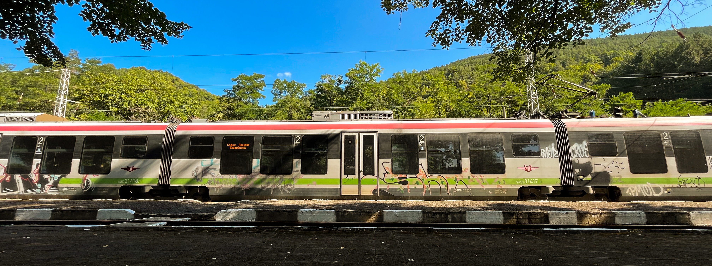

  

   
  
  

    
    
    
  

  <h1>
    hey there
    , I'm Tihomir
  </h1>

   

  

  ---
  

  ### :man_technologist: About Me :

  I am a Junior Mobile Developer  from Bulgaria 🇧🇬.

  - 🔭 I’m currently working on the BulTrain project.
  - 🌱 I’m currently learning Kotlin and mobile development.
  - 👯 I’m looking to collaborate on more projects.
  - 💬 Ask me about Kotlin, JavaScript, Python.
  - 📫 How to reach me: tihomir.garmenliev@gmail.com
  - ⚡ Fun fact: Trains are my passion. 😄

  ---
  
  ### :hammer_and_wrench: Languages and Tools :

  

    &nbsp;
    &nbsp;
    &nbsp;
    &nbsp;
    &nbsp;
    &nbsp;
  

  ---

  ### :fire: My Stats :

  

  
  

